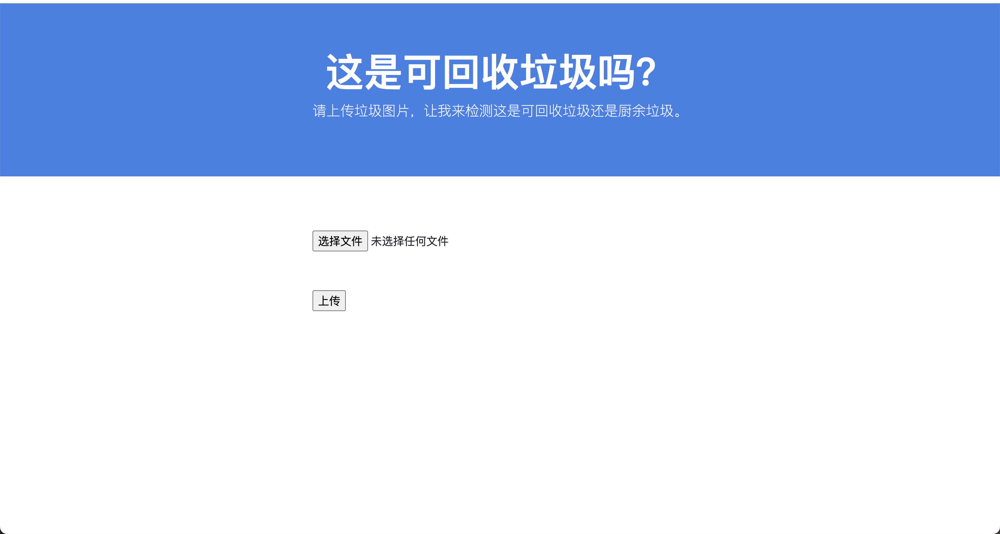
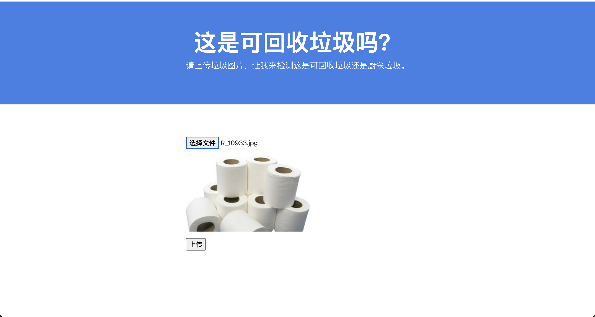
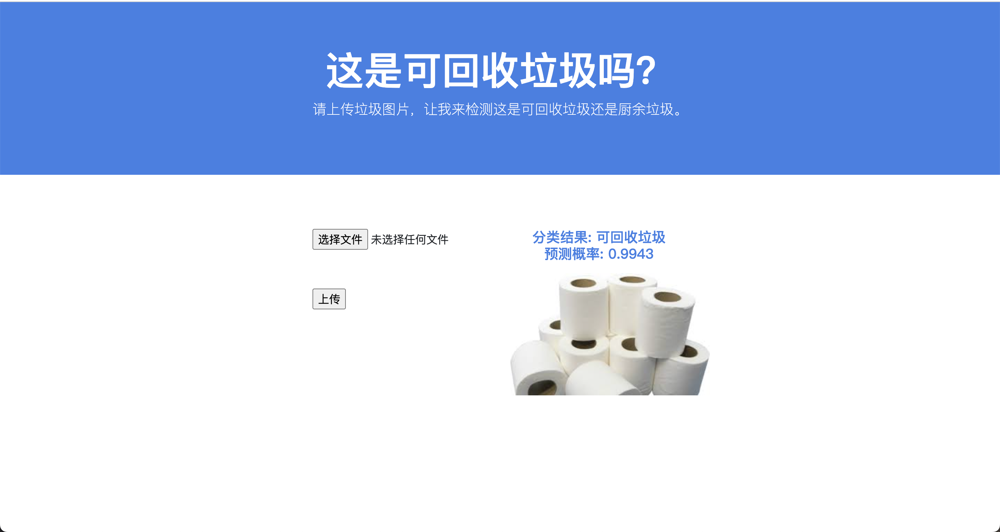

# 垃圾分类器

## 创作背景

随着人们生活质量的提高以及对环境污染的日益重视，垃圾的回收是一个巨大的挑战。特别是对于中国这样的人口大国，每个城市每天所产生的垃圾已是达到数以千万吨计，而及时高效的垃圾分类是缓解垃圾问题的重要途径。可用于解决这一问题的一个有前途的研究和创新领域是机器学习和人工智能。使用人工智能技术对垃圾进行分类可能是一种成本效益高、安全、甚至可能更准确的方法，可以及时对大量的垃圾进行分类，从而有助于提高回收率。这个作品的目的是建立一个机器学习模型，将垃圾的图像分类为厨余垃圾或可回收垃圾。

## 作品创作

作为一个智能的垃圾分类器的简单实现，该作品旨在对输入的垃圾图片进行分类，分成可回收垃圾或者厨余垃圾。我们首先在[Kaggle](https://www.kaggle.com/techsash/waste-classification-data)上收集了超过两万张的带有标签的垃圾图片，并将他们以**0.85**和**0.15**的比例分成了训练和测试数据集并进行了数据增强包括但不限于缩放、翻转和旋转。之后我们使用VGG16作为本作品的基础的深度学习模型，并固定了其在大型数据集ImageNet上进行预训练的参数，且设计了最后的全连接层并在其中引入了**归一化层**（Batch Normalization）和**随机失活层**（Dropout）以达到更好的分类结果。

以上是本作品的人工智能核心部分，为了更好的展示效果，我们使用**Flask**框架进行了前端页面的编写。该页面支持用户上传他们选择的垃圾照片。我们创建了对应的python脚本，用于将上传的图片送入训练好的深度学习垃圾分类模型。此模型会推断出该图片所对应的垃圾种类以及其概率得分，并将这些结果展示给用户。

## 运行示例

下载并解压代码。打开终端，并将路径设置为该代码文件夹的根目录。

本作品使用**python3.7**进行开发（作者使用的是**3.7.16**）。为了简化软件包管理系统和部署，强烈建议在官网下载**Anaconda**并创建新的环境。具体方法为：

- conda create -n *wasteClassifier* python=3.7 ipykernel

其中*wasteClassifier*可以替换成任意自定义的环境名称。激活对应conda环境：

- conda activate *wasteClassifier*

在此conda环境内下载需要的包（需下载pip）：

- pip install -r requirements.txt

运行python文件 `index.py`：

- python index.py

或者：

- python3.7 index.py

也可以使用**jupyter**打开 `run.ipynb`并运行（建议使用*Visual Studio Code*）。

作品的web开发使用Flask框架，如果运行成功，在终端或者jupyter notebook中会打印网址[127.0.0.1:5000](127.0.0.1:5000)。打开浏览器并转到这个网址。此网页界面如下图所示：

点击“选择文件”以选择本地的垃圾图片进行识别：

点击“上传”将图片上传并让系统进行垃圾识别。等待几秒后，系统会显示该图片对应的**垃圾分类**及其**预测概率**：

用户可以上传更多的照片已获得对该垃圾图片的分类结果。

## 作品展望

为了使得本作品有更高的准确率，我们可以设置不同的超参以及采用其他的预训练模型，如ResNet，也可以设置收集更多的垃圾种类及子类的图片已获得更为细致的垃圾分类。此外，我们还可以结合图像传感器等硬件，对垃圾进行检测和定位，以便实现的垃圾的实时动态分类。

## 贡献

**作者**：李涵文

**邮箱**：mengxiduanhun@126.com, lhwww0105@gmail.com

**微信**：lhwww257248

## 参考

- https://github.com/manuelamc14/waste-classification-model
